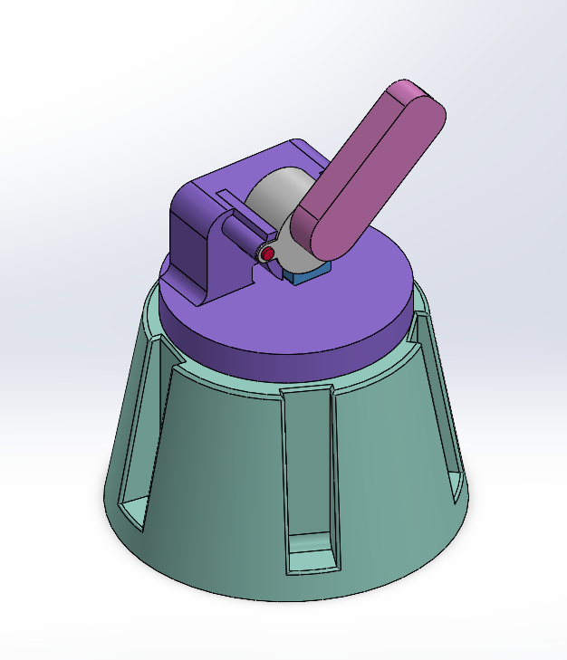
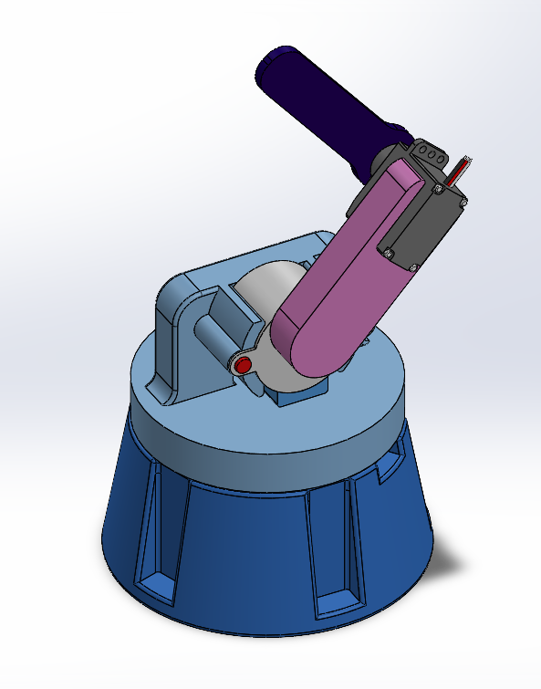
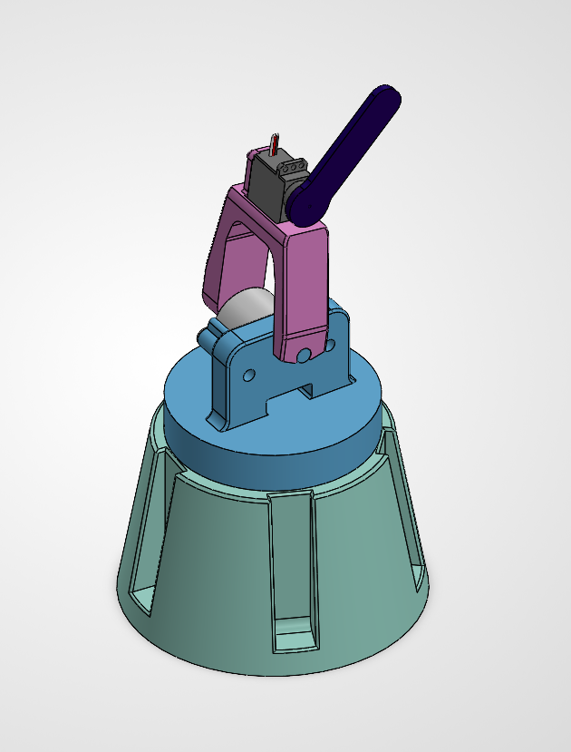

# Custom Robot Arm

## Overview

This project is a custom robotic arm designed and built from the ground up to develop my skills in robotics, mechanical design, embedded systems, and controls. The project serves as a platform for learning modern robotics concepts while continuously improving both the hardware and software.

---

## Current Features

- Custom CAD designed in SolidWorks
- 3D printed structural components
- Arduino-based control system
- Computer communication for robot control
- Simultaneous multi-axis motion using AccelStepper
- Predefined robot poses
- Adjustable joint speed and acceleration
- Software-based homing system without switches or sensors

---

## Current Development

- Exporting the robot to URDF
- Forward Kinematics
- Inverse Kinematics
- ROS2 Integration

---

## Design Evolution

### Version 1
Initial proof-of-concept focused on validating a basic robotic arm design.

### Version 2
Added a third degree of freedom, computer-controlled motion, and improved packaging.

### Version 3
Refined the mechanical design and implemented coordinated multi-axis motion, creating a more robust platform for future kinematics, URDF generation, and ROS2 integration.

---

## Project Roadmap

- [x] CAD Design
- [x] Robot Assembly
- [x] Arduino Joint Control
- [x] Software Homing System
- [ ] URDF Export
- [ ] Forward Kinematics
- [ ] Inverse Kinematics
- [ ] ROS2
- [ ] MoveIt Integration
