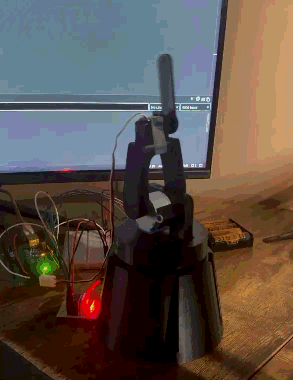
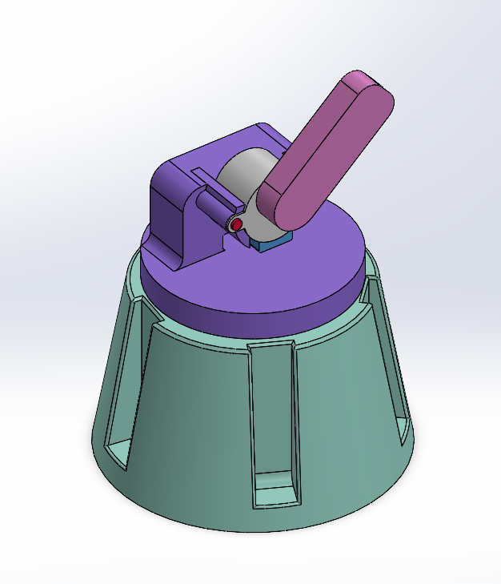
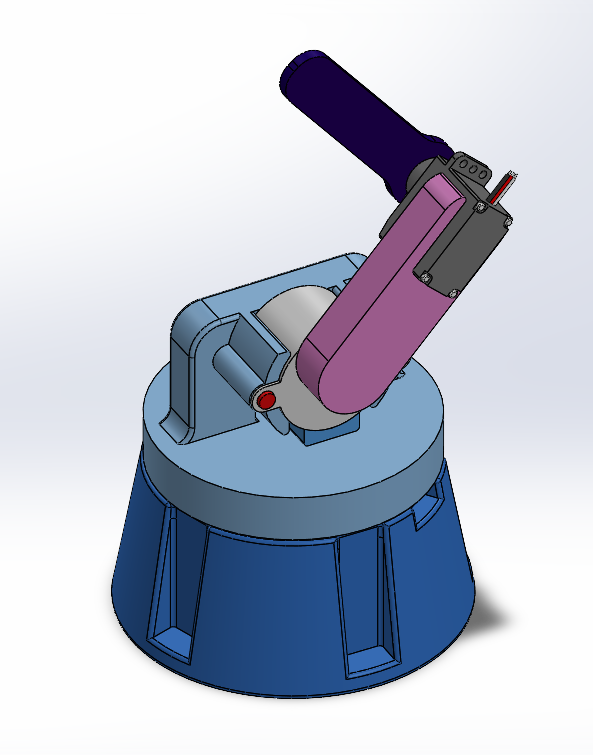
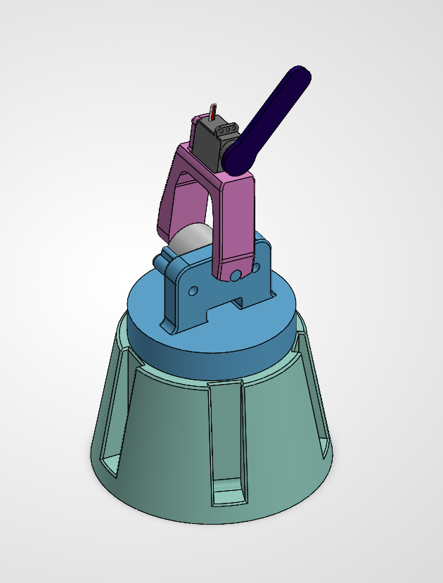

# Custom Robot Arm

## Overview
Custom 3D printed 3 DOF robot arm to improve in mechanical design, electronics, programming, and robotics with budget electronics. 

## Features

- Custom 3-DOF robotic arm designed in SolidWorks and created using 3D-printed components
- Arduino based stepper and servo control with computer to microcontroller serial communication
- Computer based control of individual and coordinated joint movements with adjustable speed and acceleration
- Software based joint position tracking and homing without physical limit switches
- Inverse kinematics for end effector positioning and coordinated joint control
- ROS 2 integration for higher level robot control and communication
- URDF robot model with joint motion visualized in RViz 

## Design Evolution

### Version 1
Initial proof of concept focused creating a basic robotic arm design.

### Version 2
Added a third degree of freedom and joint control through keyboard inputs. improved mechanical design and electrical packaging.

### Version 3
Improved design and expanded the software to support coordinated joint movement, inverse kinematics, and visualized the robot arm in RViz.   

